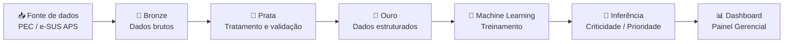

# 🧬 Nexus Data

### Plataforma Inteligente para Equidade em Saúde

<p align="center">
  <strong>Transformando dados do PEC/e-SUS APS em informação, inteligência e ação.</strong>
</p>

<p align="center">
  
  
  
  
  
</p>

---

## 📌 Sobre o projeto

O **Nexus Data** é uma plataforma de Engenharia de Dados e Machine Learning desenvolvida para apoiar a análise dos marcadores de equidade em saúde registrados no **PEC/e-SUS APS**.

A proposta é transformar um processo atualmente dependente de extrações e consolidações manuais em um fluxo **automatizado, estruturado e orientado à tomada de decisão**.

A plataforma organiza os dados, aplica regras institucionais, calcula indicadores e disponibiliza informações em uma interface gerencial.

---

# 🎯 O problema

Os dados relacionados às políticas de equidade já são registrados no PEC/e-SUS APS, incluindo:

* Raça/cor
* Deficiência
* Orientação sexual
* Identidade de gênero

O desafio está em transformar esses registros em informações confiáveis e acionáveis.

O processo manual dificulta:

* Extração recorrente dos dados;
* Padronização e tratamento;
* Cálculo dos indicadores;
* Análise por Equipe de Saúde da Família;
* Acompanhamento histórico;
* Identificação de prioridades territoriais.

---

# 💡 A solução

O Nexus Data combina **Engenharia de Dados + Machine Learning + Visualização** em uma única arquitetura.

### ⚙️ Engenharia de Dados

Automatização da coleta, tratamento e organização dos dados.

### 📊 Indicadores

Cálculo padronizado dos indicadores de equidade por equipe, unidade e território.

### 🧠 Machine Learning

Aplicação de modelos supervisionados para apoiar a identificação de situações prioritárias.

### 🎯 Priorização

Transformação dos indicadores em uma **Fila de Prioridade**, facilitando a identificação das equipes que demandam maior atenção.

### 📈 Dashboard

Interface gerencial organizada em abas, evitando excesso de informações e destacando os indicadores mais relevantes.

---

# 🏗️ Arquitetura



---

# 🔄 Pipeline de dados

## 1. 📥 Bronze — Coleta

Os dados são recebidos e armazenados inicialmente em sua forma bruta.

**Tecnologias:**

* Apache Airflow
* DuckDB

---

## 2. 🧹 Prata — Tratamento

Os dados passam por processos de:

* Limpeza;
* Padronização;
* Validação;
* Deduplicação;
* Aplicação das regras de negócio.

**Tecnologias:**

* Python
* DuckDB

---

## 3. 🗄️ Ouro — Armazenamento

Após o tratamento, os dados estruturados são disponibilizados para consumo analítico e treinamento dos modelos.

**Tecnologia:**

* PostgreSQL / NeonDB

---

## 4. 🧠 Machine Learning

Os dados preparados alimentam o processo de treinamento dos modelos de aprendizado supervisionado.

O objetivo é transformar os dados tratados em informações capazes de apoiar a identificação de situações prioritárias.

**Tecnologias:**

* Python
* Scikit-learn
* Machine Learning

---

## 5. 🎯 Inferência

O modelo gera os resultados utilizados na camada analítica.

Esses resultados podem ser organizados em uma **Fila de Prioridade**, permitindo direcionar a atenção das equipes para os casos ou grupos identificados pelo sistema.

---

## 6. 💻 Dashboard

Os resultados são apresentados em uma interface gerencial dividida por abas.

A proposta é evitar uma grande quantidade de gráficos simultâneos e priorizar:

* Indicadores;
* Tendências;
* Criticidade;
* Visão territorial;
* Histórico;
* Prioridades.

---

---

### Objetivo

A camada preditiva deve funcionar como **apoio à decisão**, e não como substituição da análise dos profissionais de saúde.

Os resultados devem ser interpretados dentro do contexto da gestão e das regras institucionais definidas para o projeto.

---

# 📍 Granularidade dos dados

Um dos diferenciais da solução é levar a análise além da visão exclusivamente agregada.

### Hierarquia analítica

**Distrito Sanitário**

↓

**Unidade de Saúde**

↓

**Equipe de Saúde da Família**

↓

**Indicadores**

Isso permite identificar diferenças entre equipes que poderiam ficar ocultas quando os dados são analisados apenas de forma agregada.

---

# 📈 Indicadores e regras de negócio

A plataforma foi projetada para aplicar automaticamente as regras definidas para o projeto.

Entre os elementos considerados estão:

* Marcadores de equidade;
* Indicadores de preenchimento;
* Regras de consentimento;
* Regras etárias;
* Indicadores por equipe;
* Agregações territoriais;
* Histórico dos indicadores;
* Critérios de criticidade.

Todas as regras utilizadas devem ser documentadas para garantir **rastreabilidade, transparência e reprodutibilidade**.

---

# 🎯 Fila de Prioridade

Uma das principais entregas da plataforma é transformar os resultados analíticos em uma visão simples para a gestão.

Em vez de apresentar apenas dezenas de gráficos, o sistema organiza as informações por prioridade.

### Exemplo conceitual

| Prioridade | Equipe   | Indicador   | Situação       |
| ---------- | -------- | ----------- | -------------- |
| Alta       | Equipe A | Indicador X | Atenção        |
| Alta       | Equipe B | Indicador Y | Atenção        |
| Média      | Equipe C | Indicador X | Monitoramento  |
| Baixa      | Equipe D | Indicador Y | Acompanhamento |

> A classificação apresentada pelo sistema deve ser interpretada como **apoio à decisão**, considerando as regras e o contexto definidos pela gestão.

---

# 🔐 Segurança e privacidade

O projeto trabalha com um domínio publico que envolve informações potencialmente sensíveis.

Por isso:

* Dados reais de pacientes não devem ser versionados no GitHub;
* Credenciais nunca devem ser armazenadas no código;
* Arquivos `.env` devem estar no `.gitignore`;
* Dados utilizados para demonstração devem ser anonimizados ou sintéticos;
* O acesso aos dados deve respeitar as regras institucionais e de governança aplicáveis;
* O modelo não deve inferir atributos sensíveis de indivíduos.

### Estrutura recomendada

```text
Dados reais
    ↓
Ambiente controlado
    ↓
Tratamento / anonimização
    ↓
Dados para desenvolvimento
    ↓
GitHub
```

---

# 👥 Equipe

## Nexus Data Team

<table>
<tr>

<td align="center">
  <br>
  <b>KFilipe Nava</b><br>
  <sub>Developer</sub>
</td>

<td align="center">
  <br>
  <b>Hallana Santana</b><br>
  <sub>SProduct Owner</sub>
</td>

<td align="center">
  <br>
  <b>Kiara Souza</b><br>
  <sub>Developer</sub>
</td>

<td align="center">
  <br>
  <b>Leandro Tavarez</b><br>
  <sub>Scrum Master</sub>
</td>

<td align="center">
  <br>
  <b>Patricia Cedraz</b><br>
  <sub>Developer</sub>
</td>

<td align="center">
  <br>
  <b>Paulo Bueno</b><br>
  <sub>Developer</sub>
</td>
</table>

---

# 🎓 Projeto acadêmico

**CESAR School — Projeto 3**

### Tema

**Equidade em Dados — Inteligência Analítica sobre o PEC/e-SUS APS para as Políticas de Equidade em Saúde do Recife**

### Parceiro

**Secretaria Executiva de Atenção Básica — Secretaria de Saúde do Recife**

### Área

**Engenharia de Dados • Machine Learning • Analytics • Saúde Pública**

---

# 📌 Status

🚧 **Em desenvolvimento**

O Nexus Data sempre esta em evolução. A arquitetura, os modelos, os indicadores e a interface podem ser modificados conforme a validação técnica e as necessidades identificadas durante o projeto.

---

# 🗺️ Roadmap

* [x] Definição do problema
* [x] Levantamento de requisitos
* [x] Definição da arquitetura
* [x] Ideação da solução
* [ ] Pipeline de ingestão
* [ ] Camada Bronze
* [ ] Camada Prata
* [ ] Camada Ouro
* [ ] Regras de negócio automatizadas
* [ ] Treinamento do modelo
* [ ] Validação do modelo
* [ ] Fila de Prioridade
* [ ] Dashboard
* [ ] Testes integrados
* [ ] Documentação final
* [ ] Deploy

---

### Documentos previstos

* Arquitetura da solução;
* Dicionário de dados;
* Regras de negócio;
* Metodologia do modelo;
* Métricas de avaliação;
* Decisões técnicas;
* Guia de execução;
* Documentação do dashboard.

---

---

# 🛠️ Tecnologias

| Tecnologia              | Utilização                             |
| ----------------------- | -------------------------------------- |
| **Python**              | Tratamento, análise e Machine Learning |
| **Apache Airflow**      | Orquestração do pipeline               |
| **DuckDB**              | Processamento analítico                |
| **PostgreSQL / NeonDB** | Armazenamento dos dados estruturados   |
| **Scikit-learn**        | Machine Learning                       |
| **Docker**              | Containerização                        |
| **Git / GitHub**        | Versionamento                          |
| **Dashboard**           | Visualização e consumo dos dados       |

---

# 🤝 Contribuição

Este projeto está sendo desenvolvido no contexto acadêmico do Projeto 3 da CESAR School.
Sugestões, melhorias e discussões técnicas podem ser registradas através das **Issues** e **Pull Requests** do repositório.

<p align="center">

### 🧬 Nexus Data


</p>
